# 2025-2026 Hunting Season

<!-- markdownlint-disable-next-line no-inline-html allow details,summary -->

2025-10-11

## 2025-10-11T15:46-06:00 (43.37613, -115.71122) 4746 feet: Danskin Lookout Road

Pullout on Danskin Lookout Road near Iron Spring for the first hunt of the
season. Hunting here because there are fewer of the nasty grasses here than
lower down.

Sad to say, but unlike other years, I haven’t been anticipating this. I’ve been
dreading the driving, I worry that Finnegan might have a seizure, and I enjoy
hunting more with a friend. And, maybe, because I’m another year older?

Mostly overcast with patches of bright blue sky. Low 50s. I’m only wearing a
wind shell over a light shirt, but it’s so breezy that I put my winter cap on
for ear protection.

Cattle are spread around the road, including at the pond and across the road
from where I’m parked, but there are none to my right, so I’ll go there.

### 2025-10-11T16:09:20-06:00 (43.37906, -115.70813) 4824 feet

Katie made a point. Finnegan came in and sort of half-honored, half-pointed.
Unproductive, and they moved on before I got to them.

Within a few minutes, both had started asking for water, and I’m already half
out. Sure wish I could get them to drink before leaving the truck.

Katie has been doing her thing of running back to me, catching my
eye&mdash;seemingly to make sure of something&mdash;and then running off again.
How do I say to her, &ldquo;It’s all good, girl?&rdquo; She has big pieces of
grass caught in her coat, but so far, none of the nasty stuff.

As is usual, I’ve had to get past a few fences. This year, it seems a little
easier to slide under them. For sure, I’m not wearing bulky clothes, but maybe
pilates and the canoe trip get some credit?

### 2025-10-11T16:55-06:00 (43.38097, -115.70088) 4870 feet

I had just made it to the bottom of one of the ravines near Crown Creek when
Finnegan went on point somewhere, up and out of sight. I started huffing my way
up when Katie's beeper went off. Good girl for honoring him! Then another
beep&mdash;I didn’t stop to check which dog&mdash;so one of them relocated. Near
the crest, the dogs were holding two birds, which flushed as I walked in. I wish
I could blame my miss on how crazy the gusty wind made the birds fly. The
important thing is, the dogs gave me a shot.

A couple of times, Katie has walked with me to give herself a
breather. No surprise given the temperature, that she’s only had leash walks
since May, and she’s 10. But I keep bumping and kicking her, so I need to
somehow explain to her that &ldquo;I’m happy to have you, but not
underfoot.&rdquo;

### 2025-10-11T17:18-06:00 (43.37616, -115.71124) 4739 feet

Truck. Katie: 8.1 miles, Finnegan: 10 miles, Ben: 2.3 miles, 1332 feet ascent

More overcast now, but still some patches of blue sky. 48° and still breezy.

That’s a good distance since neither has had a long run since late May.

I packed to spend the night, but now that sounds like something I am supposed to
want to do, so I head home.

As I’m putting things away, a few drops of rain fall. More rain on the drive
out.

<!-- markdownlint-disable-next-line no-inline-html allow details,summary -->

2025-10-18

## 2025-10-18T13:08-06:00 (43.36945, -115.71210) 4753 feet: Danskin Lookout Road

Low 50s, calm, almost entirely clear.

Leslie decided to take a nap, so it’s me and the happy dogs.

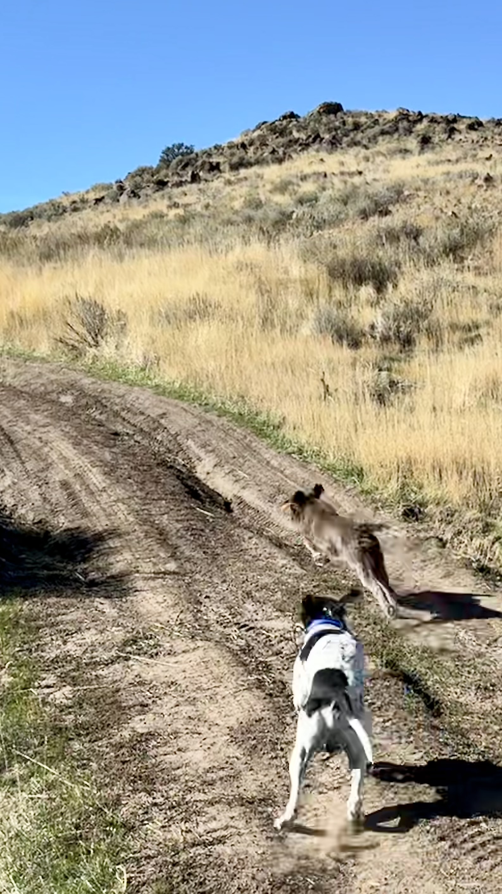

### 2025-10-18T13:38:39-06:00 (43.36946, -115.72028) 4883 feet

I turned back early because we ran into a line of cattle.

I came over a ridge and saw Katie and Finnegan pointing in opposite directions.
After I took the picture and got ready to shoot, I released them. Both ran
forward, but nothing happened. Both dogs did the usual &ldquo;where’s the bird&rdquo;
running around. Then, within a few seconds of stepping off, two huns flushed
over my head from only a few tens of feet behind where Katie had been pointing
and well to the right of where Finnegan had been pointing. Neither dog even
broke stride before the flush, and I had barely started to close my gun before
the birds were behind me and out of sight.

### 2025-10-18T14:05:12-06:00 (43.36951, -115.71210) 4757 feet

Truck. Katie 3.8 miles, Finnegan 5 miles, Ben 1.3 miles & 615 feet

### 2025-10-18T14:48:16-06:00 (43.38407, -115.71818) 4850 feet

Danskin Lookout Road.
With Leslie this time.
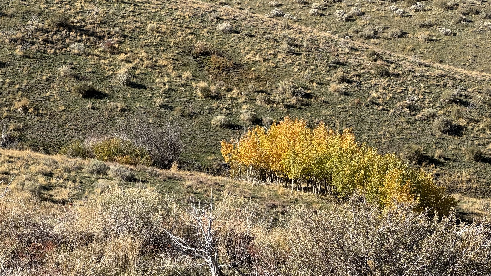

### 2025-10-18T15:53:35-06:00 (43.38412, -115.71819) 4836 feet

Truck. Katie 5.1 miles, Finnegan 6.3 miles, Ben 1.3 miles & 680 feet

No bird contact. Weather is still lovely. Many deer hunters around.

Total for the two hunts: Katie 8.9, Finn 11.3, Ben 2.6 & 1295 feet

<!-- markdownlint-disable-next-line no-inline-html allow details,summary -->

2025-10-23

## 2025-10-23T16:09-06:00 (43.39349, -115.71147) 4723 feet: Danskin Lookout Road

Danskin Lookout Road, Willow Creek Guard Station
Sunny light breeze 57°

### 2025-10-23T16:47:35-06:00 (43.40165, -115.69609) 4866 feet

Finnegan on point. Katie’s moving to where she can see him and so honor him.
Birds flushed when I wasn’t ready. Wasn’t up to the dogs yet. The breeze is
coming from Finnegan’s far left, so maybe the scent was swirling to where he was
standing?

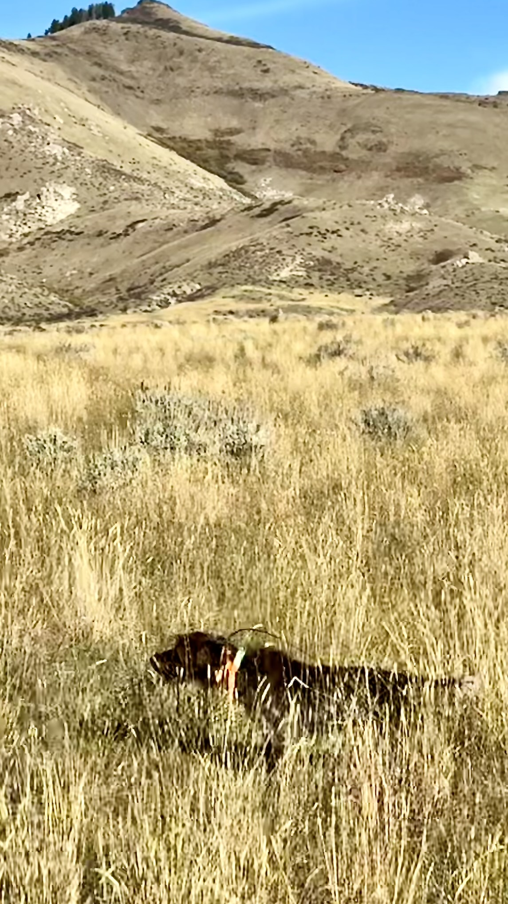

### 2025-10-23T17:50:50-06:00 (43.39351, -115.71151) 4717 feet

Truck. Katie 10 miles, Finnegan 12 miles, Ben 3.3 miles & 881 feet

No more birds.

Still quite pleasant.

Fewer cattle and more hunters than last time. I’m within eyeshot of two trailers and
a truck. Another truck came up the road I’m on. I don’t think there’s anywhere
I’m going to be able to camp where I’ll be entirely out of view, but if I
move on a bit more, I might get a rise between me and them.

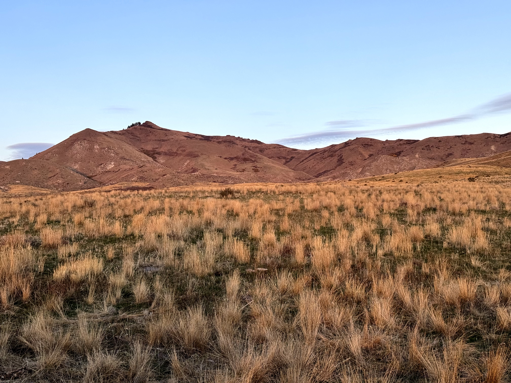

### 2025-10-23T19:12:26-06:00

The truck I saw driving in just drove out. The sun has been down for 10 to 20
minutes.

The Mr. Buddy heater isn’t working. I hear no fuel coming through. Is the tank
empty or is the hose screw up again? (The tank was fine. The hose was the
problem&mdash;again. I removed the tank and hose from the truck.)

<!-- markdownlint-disable-next-line no-inline-html allow details,summary -->

2025-10-24

## 2025-10-24T08:54-06:00 (43.39672, -115.70308) 4804 feet: Danskin Lookout Road

Camp near Willow Creek Guard Station

Off for a morning hunt. Woken before seven by a father and son walking past. The
boy asked why someone had parked on the road. Damn, these deer hunters are up
early. Multiple quads went by. Already, I can see people breaking camp.

### 2025-10-24T09:06:16-06:00 (43.39482, -115.70266) 4861 feet

Finnegan points, relocates, points. Pretty as hell, and it got me moving fast up the hill.
No birds.

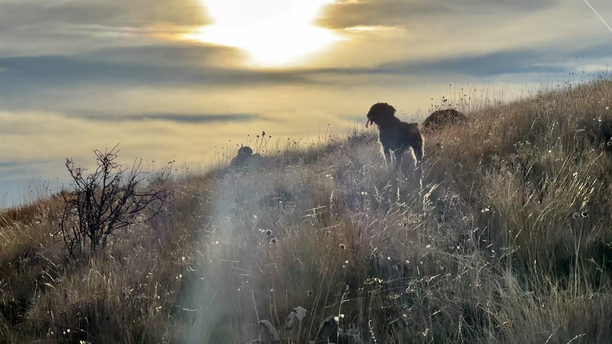

They move on a few times. The last time, Katie honored him for a while and then ran
past him. No birds. I think it’s the first time I’ve seen him confused by scent.
There’s a gentle breeze flowing directly in front of him.

### 2025-10-24T09:45:47-06:00 (43.39674, -115.70307) 4803 feet

Truck. Katie 4.1 miles Finnegan 4.8 miles, Ben 1.3 miles & 590 feet

More unproductive points.

I was quite warm once I got to climbing. I know the secret of camping in cool
weather is to get up and get moving, but damn, it's hard.

<!-- markdownlint-disable-next-line no-inline-html allow details,summary -->

2025-10-26

## 2025-10-26T12:09-06:00 (43.25333, -115.65766) 3836 feet: Immigrant Road

Immigrant Road. Light wind from SE, overcast, 42°.

Exited I-84 at Mayfield. The road was too sloppy with mud to think of
driving up to Danskin Lookout. Hope it’s not another season where mud keeps me
from getting out.

There were cattle near the turn onto Immigrant, so I drove to the power line.

Last year’s fire took out the sagebrush here, but green-up is well along.
Lots of dead
[Medusahead](https://www.invasive.org/browse/detail.cfm?imgnum=1459334 "Taeniatherum caput-medusae").
The
[Arrowleaf Balsamroot](https://en.wikipedia.org/wiki/Balsamorhiza_sagittata)
has mostly gone to seed, but there are still a few blooms.

### 2025-10-26T13:48:11-06:00 (43.25170, -115.66454) 3762 feet

Truck is in sight when Finnegan points. Katie finds him and honors him. When I
am in front, I release him, but at first, he doesn’t move. When he goes, he just
goes. Katie circles and does her &ldquo;rabbit cry&rdquo;, which tells me that there was a
lot of bird scent there.

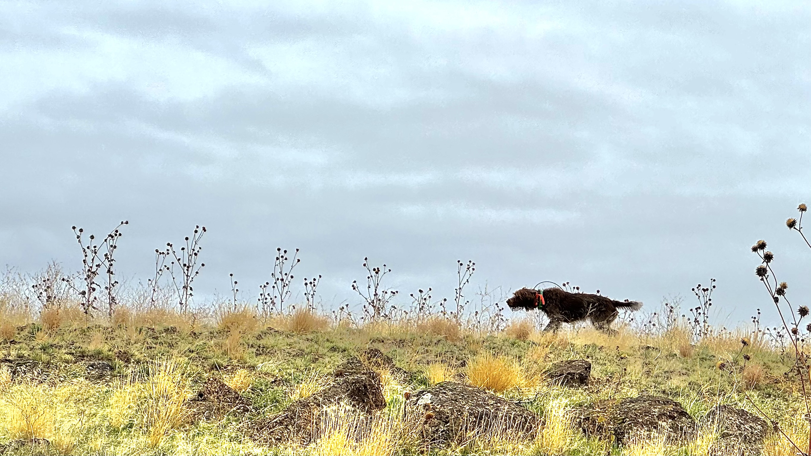

A few minutes later, he points again, and again Katie honors him. As I’m walking
in the little depression where I think the birds might be, they flush. The dogs
gave me a decent shot, and I missed with both barrels.

What did I do wrong? Didn’t move my feet towards where the birds were flying.
Pulled the first trigger before I had really focused on one bird. Pulled the
second trigger with my body twisted and without remounting the gun. Sigh&hellip;

### 2025-10-26T14:03:03-06:00 (43.25330, -115.65768) 3818 feet

Truck. Katie 13 miles, Finnegan 13.6 miles Ben 3.4 miles & 1043 feet.

Both dogs ran well. Katie ranged a bit more than she has. Weather unchanged
except for slightly heavier overcast. There is a very little mist on the truck
window.

There is snow on Danskin Peak.

I have such fond memories of Katie learning to hunt here. It’s sad to see it so
changed by fire.

<!-- markdownlint-disable-next-line no-inline-html allow details,summary -->

2025-10-31

## 2025-10-31T15:26-06:00 (43.39510, -115.70732) 4772 feet: Danskin Lookout Road

Back again to camp near Willow Creek Guard Station off Danskin Lookout.

Calm, 51°, thin overcast.

Lots of hunters are leaving the area. If memory serves, it’s the last day of the
deer season.

### 2025-10-31T16:07:26-06:00 (43.38639, -115.69415) 4745 feet

I’ve been following the road. It has deteriorated some and keeps trending down,
so I’m heading overland, out of the draw, vaguely towards the truck.

### 2025-10-31T17:40:30-06:00 (43.39509, -115.70736) 4774 feet

Truck. Katie 12.9 miles, Finnegan 13.6 miles,  Ben 3.6 miles & 1736 feet

Several beautiful points and honors, but no bird. At the end, the sun is
beginning to set. Finnegan is ranging out farther and farther. I used his
e-collar multiple times to bring him back in, and even then, I had to watch that
he wasn’t sneaking around behind me, which he did several times.

Ran out of water for the dogs. Was carrying a liter plus a squeeze bottle.

<!-- markdownlint-disable-next-line no-inline-html allow details,summary -->

2025-11-01

## 2025-11-01T11:50-06:00 (43.39648, -115.70339) 4797 feet: Danskin Lookout Road

Finally driving away. I woke up around nine because Finnegan was whining. Let
him out to pee. Had a leisurely, sticky, gooey breakfast and coffee while I
watched hunters pulling out, though I did see one headed in with what looked
like a rifle in his quad. I guess there’s something always in season?

Breezy. Warming rapidly.

Royce gave me a new air mattress. I slept well, once I got used to how much it
flexes when I roll over. And I used my old, old, old winter-weight synthetic
sleeping bag. I’m not sure that it’s warmer than my newer, lightweight bag, but
it’s much less fragile. Plus, it’s a tall size, which means I can burrow much
deeper into it.

Saw one hunter with a blaze cap that I assume had dogs. He’s headed up the ridge
where I moved birds last time I was here and where the dogs were going so crazy
last night. A bit later, I heard two shots and then saw somewhere between five
and seven birds flush away from him.

### 2025-11-01T11:29:05-06:00 (43.42800, -115.72685) 4530 feet

Parked  near Cottonwood Creek. There is still a compound here: three campers, a
horse trailer, a quad, and five pickups. Don’t see anyone around, so I’m still
going to hunt here.

Lots of green grass.

### 2025-11-01T11:40:06-06:00 (43.42609, -115.72544) 4568 feet

Finnegan points two birds. They flush and he and Katie break.

A few minutes later, six birds flush in the opposite direction. The dogs are
nowhere near them.

Finnegan is pointing where the birds flushed from. I go in ready in case there
might be a straggler, but no luck.

### 2025-11-01T12:06:05-06:00 (43.42286, -115.71583) 4702 feet

Four birds within 20 feet of Finnegan’s nose. When they flushed, he broke, so no
shot. His second time being a bad boy!

It’s quite warm, and the dogs are going through water fast.

### 2025-11-06T12:49:47-06:00 (43.42799, -115.72688) 4525 feet

Truck. Katie 7 miles, Finnegan 7.2 miles, Ben 2.1 miles & 668 feet

Finnegan was starting to stop and look around, so he was getting tired. And I was down till the last few
squeezes of water, so we called it a day.

<!-- markdownlint-disable-next-line no-inline-html allow details,summary -->

2025-11-06

## 2025-11-06T14:52-07:00 (43.60956, -115.93219) 3025 feet: Macks Creek

Intermittent rain today, but partly cloudy now. Calm. Aspen are pretty.

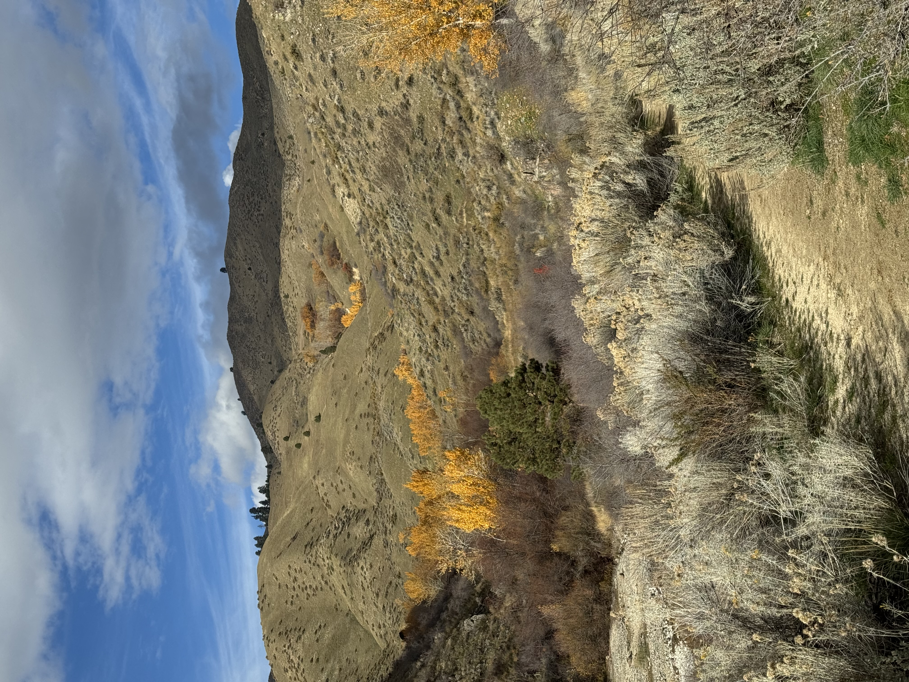

### 2025-11-06T15:41:22-07:00 (43.62280, -115.94011) 3460 feet

Finnegan was on point for a while. As I was moving towards him, I heard  a soft
flush from in front of him. Then, a hundred feet away, on the other side of the
creek, Katie started screaming like she was being beaten. If this grouse was
doing what I expect, it flew a short distance and then started running. I called
Finnegan, but whenever she screamed, he’d turn back to her. So, I couldn’t get
him to hunt the bird.

### 2025-11-06T16:17:28-07:00 (43.60960, -115.93232) 3086 feet

Truck. Katie 5 miles, Finnegan 6.5 miles, Ben 2.5 miles & 925 feet

Finnegan hunted hard on the way back, but no luck. Katie stuck close to the
trail and ate grass.

<!-- markdownlint-disable-next-line no-inline-html allow details,summary -->

2025-11-07

## 2025-11-07T15:40-07:00(43.37607, -115.72748) 4933 feet: Danskin Lookout Road

Camping spot off Danskin Lookout Road, looking west, into the valley. Breezy,
46°, mostly clear, partly cloudy

### 2025-11-07T17:20-07:00(43.37606, -115.72745) 4932 feet

Truck. Katie 9.8 miles, Finnegan 11.4 miles, Ben 3 miles & 1663 feet

No bird contacts&mdash;haven’t had that for a long time. The far side of the
hill to the SE of this site is difficult&mdash;lots of rocks to step around
while going down a steep hill. Also, the steep road off Danskin Lookout Road
that starts heading towards this site turns away.

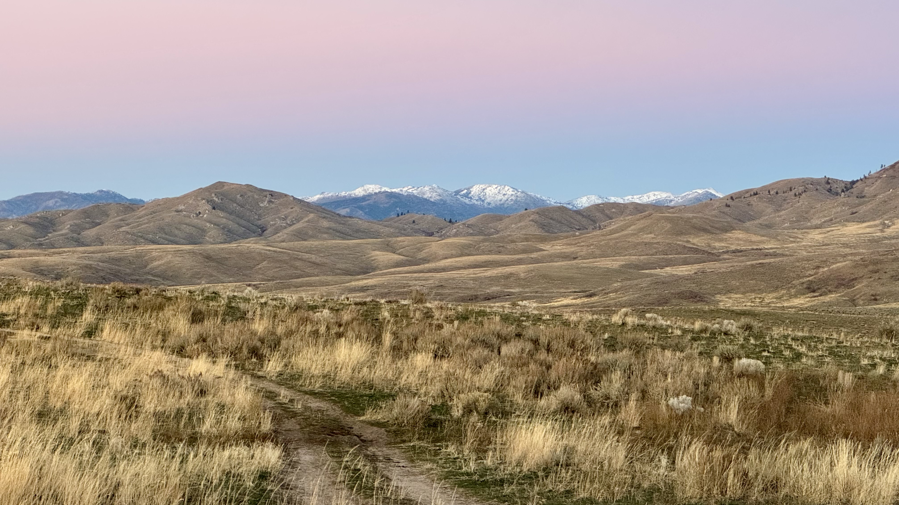

I was warmer in my new insulated bibs but I still wasn’t comfortable sitting in
the breeze. So, I'm back in the truck.

<!-- markdownlint-disable-next-line no-inline-html allow details,summary -->

2025-11-08

## 2025-11-08T11:30-07:00(43.37604, -115.72749) 4928 feet: Danskin Lookout Road

Something woke me up around 4:30, and then Finnegan kept moving around his
crate, which kept me awake for another hour. I finally gave in and got up. Both
dogs peed, and I peed. I lifted them up to the sleeping platform and then,
eventually, got them under their sleeping bag. It took a while for them to
settle down, but eventually they did, and we all fell asleep. It was after 10
when I woke up.

While I was drinking my coffee, a cowboy came through on a motorbike and said
that there would be trucks, etc., showing up to move cattle around noon. He said
that it would be fine for me to stay here but warned that it would be hard for
me to get out once they got active.

<!-- markdownlint-disable-next-line no-inline-html allow details,summary -->

2025-11-08

## 2025-11-08T12:52-07:00(43.28391, -115.53843) 5018 feet: Long Tom Reservoir

Parked on Long Tom Reservoir road, just off NFD 131 (Nation Forest Development Road, aka Prairie Road).

Sunny, 45°, light breeze.

### 2025-11-08T13:04-07:00(43.28298, -115.54238) 4924 feet

As I’m walking on the right side of the road, about seven huns flew well over my
head, from somewhere over the ridge to my right (north). Finnegan had just
crossed the ridge. I don’t know what happened, but he did not point. Katie is
working ground scent. Maybe where those birds had come from?

### 2025-11-08T13:57-07:00(43.28117, -115.56581) 4579 feet

The reservoir is just in sight, but Finnegan is at 5.5 miles, so I turn us back.
The reservoir still has some water in it, but not much, which is more than I
usually see. I walked the right side of the road until the power line. The
ground got a lot steeper there, so I headed to the south side of the road.
There’s still water in the creek.

### 2025-11-08T14:30-07:00(43.28357, -115.54090) 4968 feet

We're close to the truck when Katie and Finnegan cooperate to flush 7 birds and
then a single that was stuck. Damn dogs. I think what happened is that Katie
approached Finnegan and the birds from the front. When he saw her, he took the
birds out. The brush is well over both their heads, and she was coming in from
up wind of the birds, so there was an element of surprise.

### 2025-11-08T14:40-07:00(43.28390, -115.53842) 5003 feet

Truck. Katie 8 miles, Finnegan 9.4 miles, Ben 3.4 miles & 1020 feet

A guy in a jeep pulled off NFD 131 just as I reached the truck. The driver wanted to
know if I’ve seen  any elk and how bad the road is. He decided not to drive to
the reservoir. While I’m talking to him, the dogs are eating human feces. Damn
the hunters that leave toilet paper and shit piled by the road.

My back is sweaty and I have my pants vented. This is *weird* November weather.

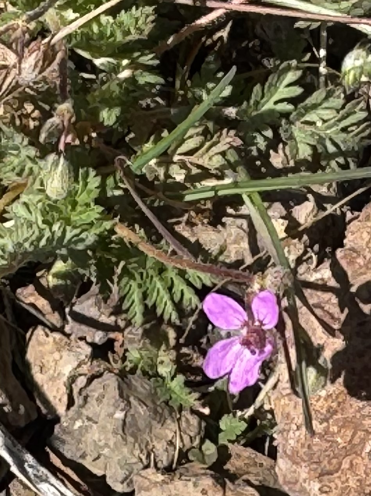

A few flowers are still blooming.

<!-- markdownlint-disable-next-line no-inline-html allow details,summary -->

2025-11-13

## 2025-11-13T13:53-07:00(43.38303, -115.87835) 3534 feet: Cornell Boise River WMA

Overcast, a few sprinkles, light breeze, 65° (yes, in November)

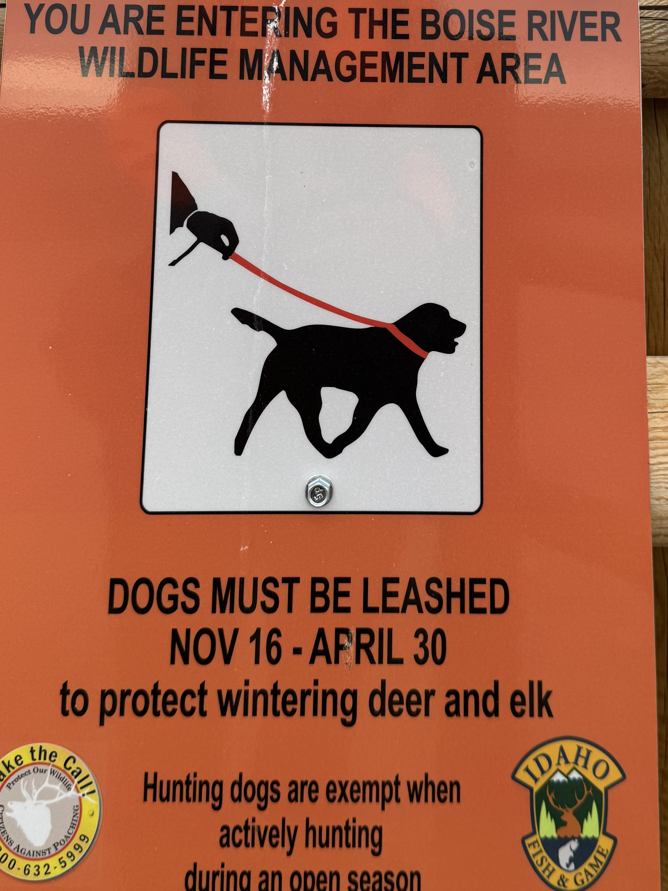

After we started, Finnegan pointed, Katie honored, both moved a few times, and
then decided there were no birds. A few minutes later, I picked up a new shotgun
hull. Someone else was fumbling with their gun here.

### 2025-11-13T14:53:05-07:00(43.39471, -115.86762) 3759 feet

Finnegan is at 5 miles, so I left the track to start making a loop. I moved two
bull elk out of the ravine.

### 2025-11-13T15:10:12-07:00(43.39486, -115.87753) 3331 feet

I’m still in the ravine that the elk came out of when I flushed 8 to 12 birds.
No points. Finnegan was on a ridge well to my left. What little breeze there is
in the ravine was at Katie’s back.

Because it’s so warm, I’m almost out of water, so we will not follow up.

### 2025-11-13T15:50:54-07:00(43.38304, -115.87835) 3534 feet

Truck. Katie 10.7 miles, Finnegan 11.3 miles, Ben 2.9 miles and 1126 feet

A few raindrops. Very light and intermittent breeze. Some canine is making noise
on the other side of the road.

All sorts of nasty grasses here.

<!-- markdownlint-disable-next-line no-inline-html allow details,summary -->

2025-11-15

## 2025-11-15T10:50-07:00(43.40332, -115.86099) 3738 feet: Cornell Boise River WMA

58°, mostly sunny, calm.

### 2025-11-15T12:00-07:00(43.40531, -115.84628) 3960 feet

The stream is trickling past a cattle trough and into an algae-filled pond.
Lots of green grass and a willow-filled ravine.

### 2025-11-15T12:34:31-07:00(43.40060, -115.85789) 3766 feet

Two birds. Finnegan points for a long time. When Katie gets into sight. she
honors.

He relocated, and Katie did not move. Then he relocated again and flushed the
two birds. Very light breeze at his back when he relocated.

### 2025-11-15T12:51:37-07:00(43.40327, -115.86103) 3699 feet

Truck. Katie 9 miles, Finnegan 11.4 miles Ben 2.6 miles & 1229 feet

Warm and still.

<!-- markdownlint-disable-next-line no-inline-html allow details,summary -->

2025-11-21

## 2025-11-21T15:14-07:00(43.37615, -115.71121) 4735 feet: Danskin Lookout Road

Dense fog until a few hours ago. Left home when it started to break.
Partly cloudy now, but some low clouds are still moving out.
Parked near Iron Spring. 43°

### 2025-11-21T16:07:59-07:00(43.38825, -115.70411) 4994 feet

Finnegan went on point twice 100 to 150 yards to my SE. Shortly after the second
point, I saw seven or so birds flush. No idea what he did, but he was out there
by himself.

We had just crossed to the road side of the big fence line that parallels the
main road.

After we got moving he pointed again. As Katie was coming in, the thick brush
kept her from seeing him. I gave her an &ldquo;easy&rdquo;, which slowed her
down enough that she started looking, saw him, and honored him. He relocated a
couple of times and then went on. I don’t think this is where the birds came
from flushed but it could’ve been.

### 2025-11-21T16:44:24-07:00(43.37613, -115.71118) 4727 feet

Truck. Katie 10.1 miles, Finnegan 10.5 miles, Ben 2.5 miles & 1040 feet

The sun is barely above the western ridge, and he temperature is dropping.

Very light breeze. I see a few people camping, but it’s nothing like the
compounds that are set up during the main rifle season.

I came back to Willow Creek because the dogs stay close&mdash;they dig after
critters instead of exploring. And it’s less exposed to the wind than the ridge.

### 2025-11-21T18:05:44-07:00(43.39562, -115.70608) 4398 feet

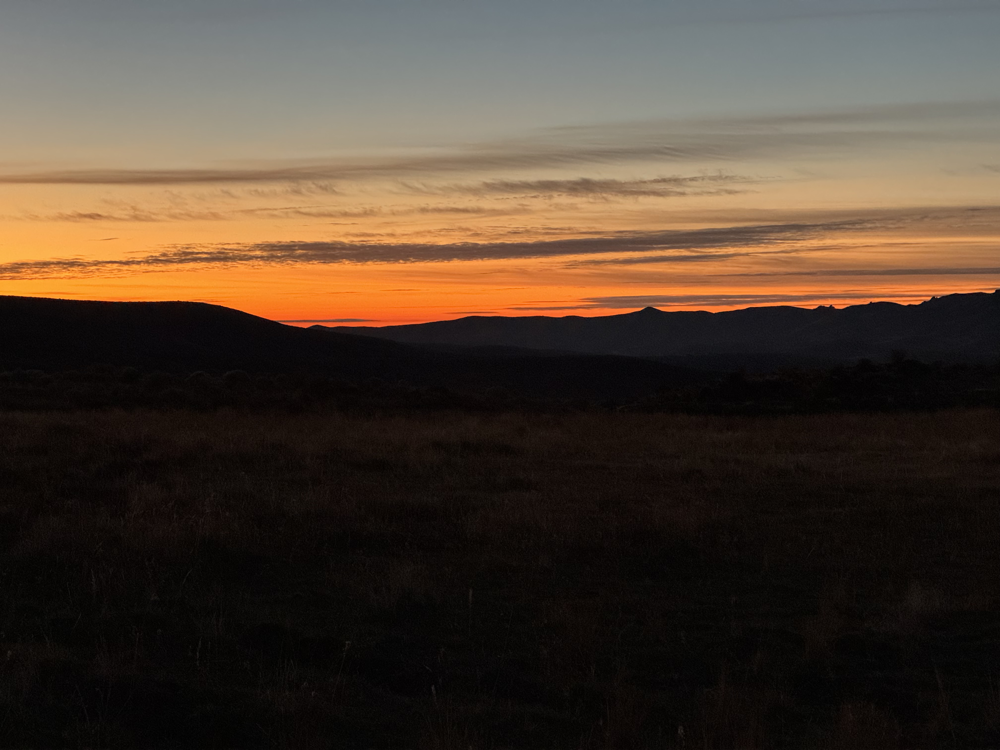

Dogs are fed. I've decided to experiment with putting the dog crates outside and
letting the dogs sleep loose. The dogs might be annoying, but it does give me
more room. So far, Finnegan is happy under the bag, but Katie, not so much. She
is sitting up.

I’m sitting on the truck bed, eating pozole from a thermos. The soup is hot.
Pre-warming a better thermos makes a big difference.

There is still little light still in the west. I sip my cocoa and watch the
colors.

After dark, I saw one of the Starlink deployments. Very weird. First I saw a
tumbling bright spot which disappeared, and then, a few minutes later, the line
of lights appeared.

As I was watching that, two guys drove past in a quad, heading towards the road.
They stopped to look at the sky show, and we chatted for a bit. Apparently,
there’s a late archery season.

In the far distance, I see someone driving down a steep hill. They are hard
core, staying out this late.

### 2025-11-21T21:31-07:00

Calm, clear overhead, 30°, and frosty. Heading to my bag.

<!-- markdownlint-disable-next-line no-inline-html allow details,summary -->

2025-11-22

## 2025-11-22T06:01-07:00(43.39559, -115.70609) 4749 feet: Danskin Lookout Road

I was awake and both dogs were stirring, so we all got out, peed, and went back
to bed.

Several quads went past in the dark, heading out for their morning hunt. 22°,
calm, clear.

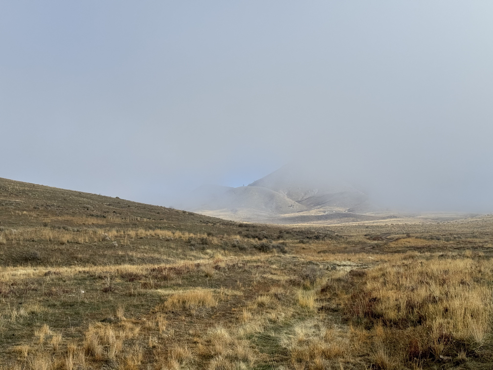

### 2025-11-22T11:44:02-07:00(43.39562, -115.70617) 4808 feet

We’ve been up for almost an hour.

Fog is mostly burned out on the peaks, though the top of Danskin Peak is still
in clouds. Visibility was only a few hundred feet when we got out of the truck.
It’s now up to a few hundred yards.

Except for a cup, a gallon of water that I left out overnight was frozen solid.

More condensation than usual in the camper. Pillows and sleeping bags are wet.
Was awakened by water dripping on my face. I left the back of the camper open to
air out while we’re hunting.

Twenty minutes or so ago a dog up on the ridge barked at me. Being sociable, I
barked back. Whoever was handling it called it towards him.

### 2025-11-22T12:57:17-07:00(43.39519, -115.70644) 4784 feet

Finally off to hunt. Overhead, the sky is clear with a line of dense clouds to the NW. Light breeze.

A big varying hare, fully in winter white, loped a few feet in front of me. Dogs
are pointing up on the ridge.

Katie pointed, Finnegan came around behind and pointed too. After a few minutes,
they moved on.

### 2025-11-22T13:16:23-07:00(43.38905, -115.70320) 5005 feet

Eight or nine birds flushed. I was looking for the dogs and not for birds. The
birds were more or less in front of me, and the dogs were well off to my
right&mdash;not at all where I thought they were.

### 2025-11-22T14:27:43-07:00(43.39562, -115.70612) 4779 feet

Truck. Katie 10.4 miles, Finnegan 12.2 miles

We went up the hill, followed the fence line, and then when the side hill got
too steep, turned back towards the road, then down through a valley. When we
came to the road to the guard station, we crossed and made a short loop on the
other side of it.

Bank of clouds still in the NW but clear otherwise. Light breeze.

My ear tips were cold, but I was otherwise comfortable wearing a T-shirt and a
shirt. What a change from last night and the damp gray this morning!

<!-- markdownlint-disable-next-line no-inline-html allow details,summary -->

2025-11-23

## 2025-11-23T12:52-07:00(43.40340, -115.86112) 3739 feet: Cornell Boise River WMA

Per one map, this area is called &ldquo;The Roost&rdquo;.

Low 40s, mostly clear, with a light breeze. Leslie and both dogs. We head NE, towards water.

### 2025-11-23T13:21:55-07:00(43.40651, -115.85307) 3980 feet

Finnegan went on point at more than 200 yards, somewhere up over the ridge. I
was still about 50 yards away when Katie found and honored him. I could not see
either dog. A few steps later, I saw birds flush both directions. Maybe Katie
arriving on the scene was one predator too many? I wish I could’ve gotten there
sooner, but I can’t climb any faster. He was on point for a long time.

A few minutes later, he points at 230 yards, up on yet another ridge. By the
time I got to him, he’d relocated multiple times. When I walk to where he’s
pointing, he dashes forward, then runs off. No birds.

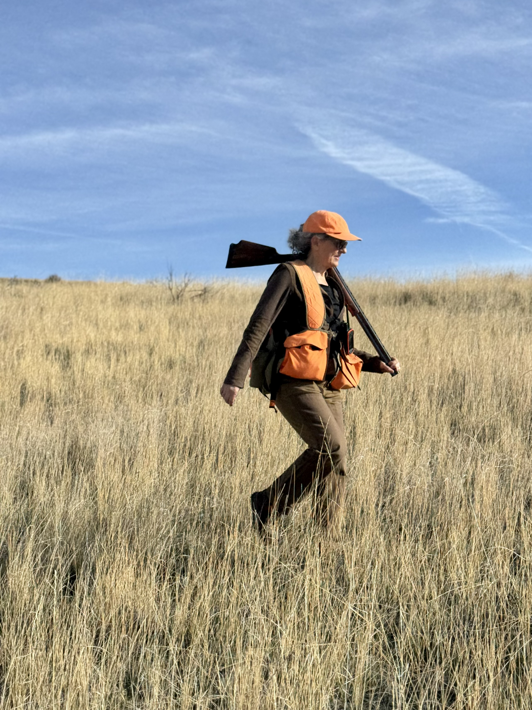

### 2025-11-23T14:52:18-07:00(43.40490, -115.85463) 3900 feet

Katie points, Finnegan honors, then Finnegan relocates and points. As I walk in,
the cattle that are a few hundred yards in front of us start to move away. Then
three birds flushed. I fumbled the shotgun and eventually got a delayed shot
off. No bird.

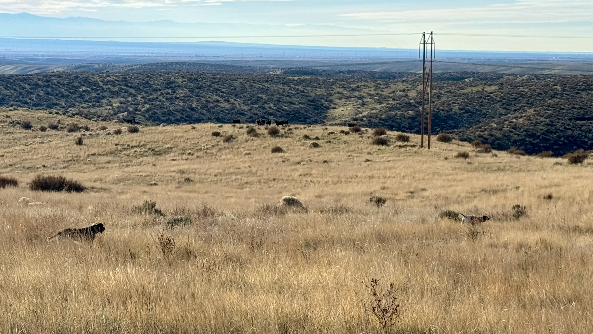

### 2025-11-23T15:09:56-07:00(43.40341, -115.86114) 3732 feet

Truck. Ben and Leslie 2.8 miles & 1409 feet, Finnegan 14 miles, Katie 11.6 miles

Thin overcast has moved in but it’s still mostly clear with a slight breeze.

Dogs were after some non-bird critter and were enthusiastically pointing bushes.
And yet, they found and held two coveys. Nice work.

<!-- markdownlint-disable-next-line no-inline-html allow details,summary -->

2025-11-27

## 2025-11-27T12:08-07:00(42.85826, -115.35807) 3140 feet: Glens Ferry

The &ldquo;Pigeon barn&rdquo;

54° Light breeze, partly cloudy.

Leslie and both dogs are with me.

Hawk soaring over the WMA

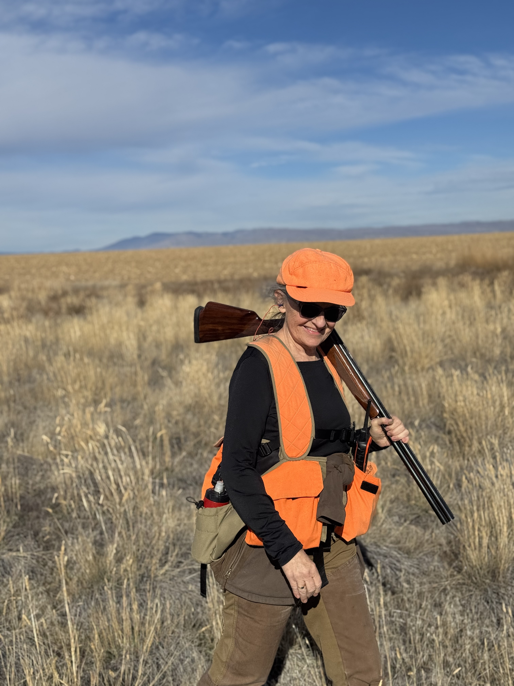

### 2025-11-27T12:32:15-07:00(42.85791, -115.35299) 3101 feet

An unproductive point and honor. They relocate, Finnegan makes a flash point,
and then we hear Katie yipping. We couldn’t see the dogs so we don’t know what
happened.

### 2025-11-27T12:43:26-07:00(42.85787, -115.34901) 3093 feet

Leslie said the dogs were working around an area close to the harvested field
when a rooster pheasant flushed out into private property. Leslie said it seemed
like the dogs were trying to see it instead of pointing on scent. I was a few
tens of yards in the field.

### 2025-11-27T12:57:44-07:00(42.85726, -115.34583) 3058 feet

Both dogs pointed and then both ran in, flushing two pheasant. Leslie said at least one was a
rooster.

### 2025-11-27T14:02:21-07:00(42.85835, -115.35789) 3112 feet

Truck Katie 9.4 miles Finnegan 10.5 miles Ben 2.2 miles

57° Breeze is lighter. Mostly cloudy.

### 2025-11-27T14:30:54-07:00(42.86576, -115.35307) 3138 feet

Hunting the &ldquo;GF WMA&rdquo;, which is a small block of land that we haven’t
hunted before.

Sky back to PC and the breeze has dropped.

### 2025-11-27T15:47:23-07:00(42.86577, -115.35313) 3132 feet

Truck. Finnegan 6 miles Katie 5.2 miles, Ben 1.1

I lost a water bottle and then we spent time looking for it. Then Finnegan
started to run off, across a dirt road, into a harvested field. Gave up in
disgust.

The compass&mdash;not the GPS&mdash;was swinging as much as 180°. I calibrated
it but it didn’t help.

Both dogs were pawing at bushes and both made unproductive points.

<!-- markdownlint-disable-next-line no-inline-html allow details,summary -->

2025-11-30

## 2025-11-30T13:26-07:00(43.38311, -115.87819) 3544 feet: Cornell Boise River WMA

36°, breezy mostly cloudy. One other vehicle here. A young man with wirehair
finished his hunt as I was getting ready.

### 2025-11-30T15:25:35-07:00(43.38309, -115.87819) 3537 feet

Truck. Katie 11.2 miles, Finnegan, 12.6 miles, Ben, 3 miles & 1911 feet

37° windy, mostly clear

No points, except of bushes.

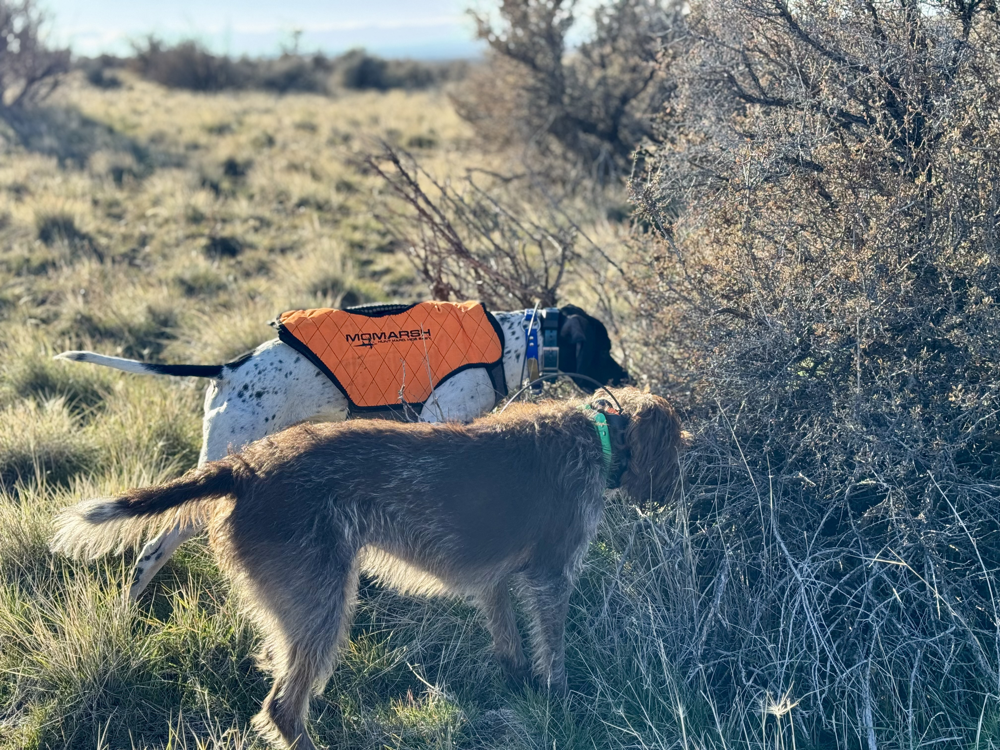

Saw feathers from one bird. Gray feathers, some fairly long, so maybe a magpie?

<!-- markdownlint-disable-next-line no-inline-html allow details,summary -->

2025-12-06

## 2025-12-06T15:20-07:00(43.25402, -115.67218) 3750 feet: Immigrant Road

Rainy in Boise this morning, but it started to clear off, so I drove here.
Partly cloudy and breezy, 49°. No one else is here.

### 2025-12-06T16:31:06-07:00(43.25403, -115.67356) 3737 feet

Truck. Katie 9.3 miles, Finnegan 10.8 miles, Ben 2.3 miles

When we were almost to the truck, the dogs pointed a covey.
Six huns flushed. I shot, but they were a blur to me.
Shooting is hard enough without blurry vision.

I was happy that I had the sense to not try to handle the dogs. When Finnegan
first pointed, his tail was wagging. Katie honored him, and I hung back.
Finnegan moved a few times. Each time he moved, Katie moved too. Each time he
froze, she froze too. It was lovely. When he was set, I moved in and the birds
flushed.

Weather is unchanged. The sun is setting.

<!-- markdownlint-disable-next-line no-inline-html allow details,summary -->

2025-12-11

## 2025-12-11 (43.27090, -115.66930) 3933 feet: Syrup Creek Road

With Jack McHugh and his 7-month-old Bracco-Italiano, Ruby, and Finnegan.
I left Katie at home so that she’s not tempted to bully Ruby.

Sunny, warm (low 50’s), and quite breezy.

Ruby did normal puppy things: hung close for a while, then pointed bushes, followed Finnegan, snacked on cow pies, etc. After a bit, she started to range out. We took the check-cord off her after a short while, and she started to move around more.

Ruby 8 miles, Finnegan 12.9 miles, Ben 3.7 miles

<!-- markdownlint-disable-next-line no-inline-html allow details,summary -->

2025-12-13

## 2025-12-13T11:39-07:00(43.39053, -115.86653) 3602 feet: Cornell Boise River WMA

53° calm, mostly sunny. One car each at two different parking lots. This place
has been discovered.

### 2025-12-13T13:22:02-07:00(43.38183, -115.85757) 3681 feet

Saw another dog and then, a bit later, the hunter. He’s coming in from the other
side. I’m starting to loop.

They both pointed a while ago, but it was unproductive. Deer scat, crows, and a
few tweety-birds. Dogs are going through water like there’s no tomorrow. They
were saved by a couple of puddles on the two-track. So warm.

### 2025-12-13T13:51:25-07:00(43.39053, -115.86643) 3570 feet

Truck. Katie 12.1 miles, Finnegan 15.1 miles, Ben 3.5 miles & 1065 feet

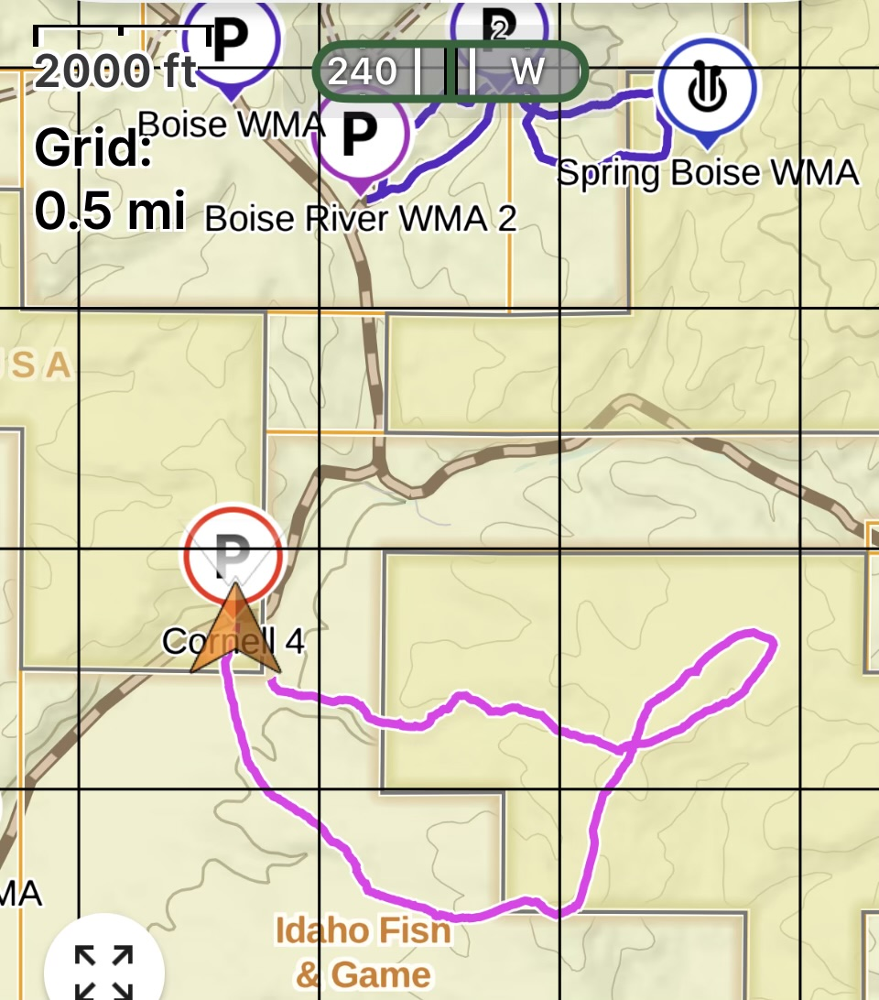

<!-- markdownlint-disable-next-line no-inline-html allow details,summary -->

2025-12-14

## 2025-12-14T15:xx-07:00(43.26649, -115.66377) 3917 feet: Syrup Creek Road

56°, mostly clear, very light breeze.

Cattle are widely spread south of Immigrant Road, so I came up here.

### 2025-12-14T17:05:22-07:00(43.26649, -115.66378) 3910 feet

Truck. Katie 9.9 miles, Finnegan 10.9 miles, Ben 3.1 miles 780 feet

Sun just set. No birds. One ranch truck.

<!-- markdownlint-disable-next-line no-inline-html allow details,summary -->

2025-12-20

## 2025-12-20T13:10-07:00(43.28434, -115.54033) 4980 feet: Long Tom

35° calm, sunny. Patches of snow over mud.

### 2025-12-20T13:26:56-07:00(43.28253, -115.54336) 4900 feet

Finnegan flushed a covey of 8 to 12 birds.
He has not been having good luck. I watched him come down into a ravine, and he
clearly did not know they were there.

I was sliding on the mud on the road, so I was walking in the brush.
Neither of them saw the mouse-like creature that just dove into a bush a few feet from them.

### 2025-12-20T14:10:55-07:00(43.28553, -115.57093) 4491 feet

Finnegan has run more than 7 miles, so I’m heading back.
No bird contact except the birds he flushed.

### 2025-12-20T15:00:23-07:00(43.28196, -115.54666) 4835 feet

Katie went yipping after a snowshoe hair in full white
and is limping a little when she returns.

### 2025-12-20T15:18:57-07:00(43.28435, -115.54032) 4969 feet

Truck. Katie 12.6 miles Finnegan 14.3 miles, Ben 3.9 miles and 1130 feet.

Thin overcast. slight breeze, 35°

Unless conditions allow driving down to where the quail are, I don’t think it’s worth hunting here.
Finnegan is at his limit around the time that comes in the site.
The only birds we run into in the upper part of the road are very near the FS Road.

<!-- markdownlint-disable-next-line no-inline-html allow details,summary -->

2025-12-25

## 2025-12-25T10:36-07:00(43.38304, -115.87835) 3540 feet: Cornell Boise River WMA

Christmas Day.

52°, breezy, mostly cloudy. Came out because it’s been raining for a few days,
and there’s a break in it this morning. The road is muddy and there are lots of
puddles.

It’s been so warm that few wildflowers are blooming.

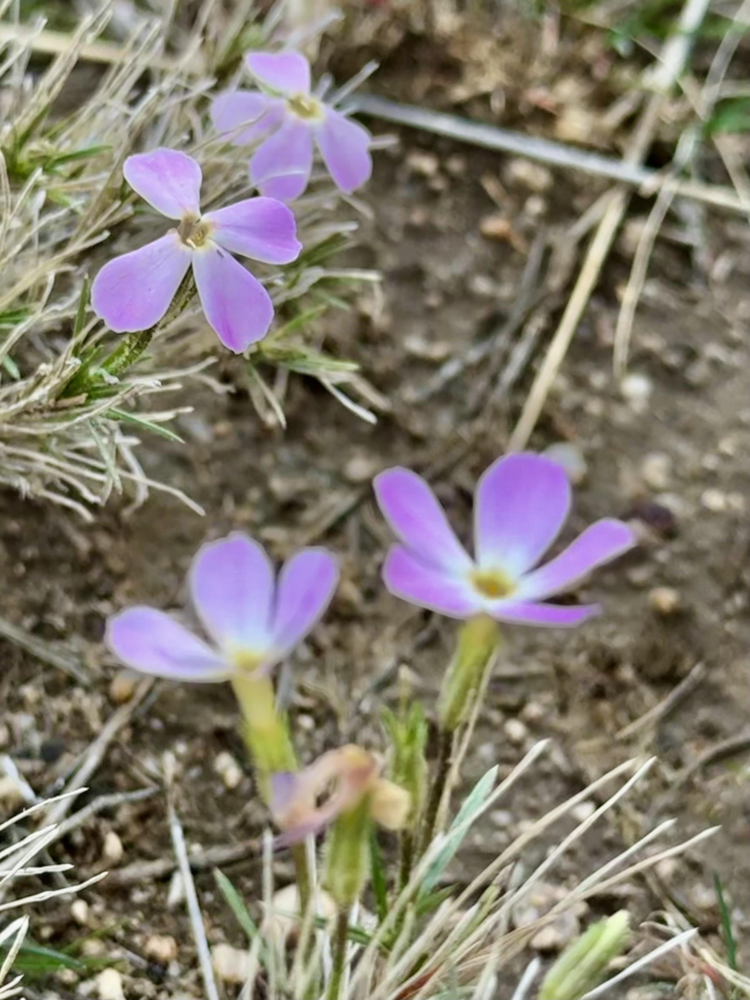

### 2025-12-25T12:18:54-07:00(43.38301, -115.87831) 3536 feet

Truck. Katie 11 miles, Finnegan 13.8 miles, Ben 3.5 miles & 1280 feet

Weather unchanged.

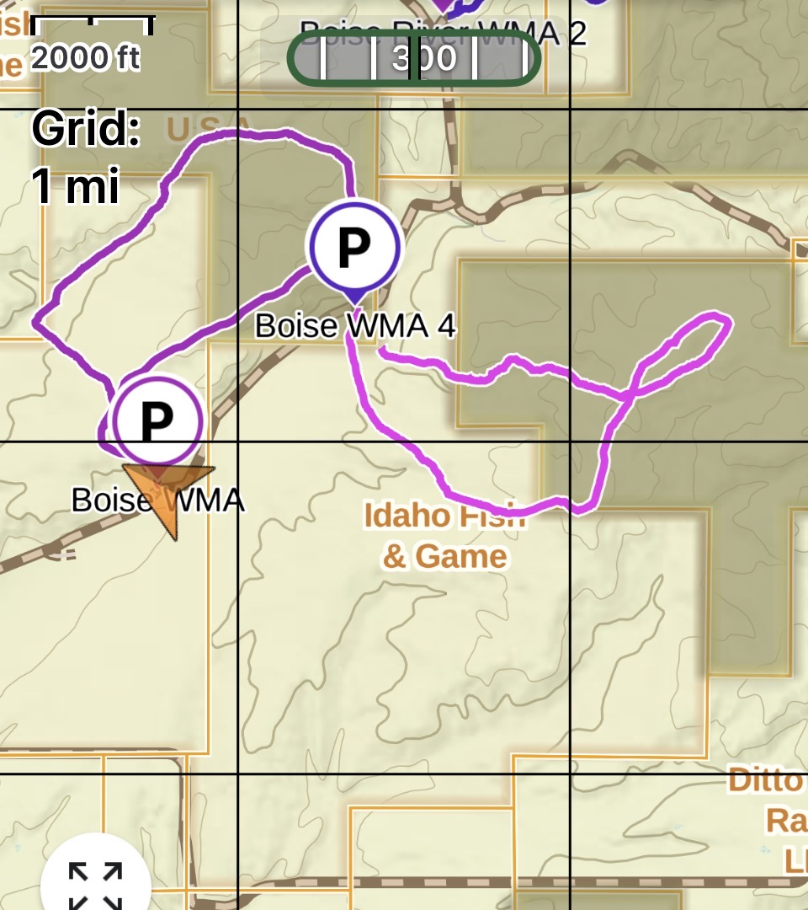

Never rained. Shot every bird the dogs pointed (none). There is a truck parked
next to mine.

I just heard two shots from across the road from the parking lot, but don't see
the hunter or the dogs.

<!-- markdownlint-disable-next-line no-inline-html allow details,summary -->

2025-12-27

## 2025-12-27T13:15:30-07:00(43.25402, -115.67216) 3754 feet: Immigrant Road

34° windy with gusts, mostly cloudy. A few flakes of snow on the drive in.
Tumbleweeds were blowing over the freeway.

### 2025-12-27T14:53:57-07:00(43.25400, -115.67218) 3747 feet

Truck. Katie 10.7 miles, Finnegan 11.9 miles, Ben 2.8 miles & 57 feet

Weather unchanged.

No bird contact. A Few cattle got Finnegan’s attention. Katie yipped after
something, probably a hare.

Tumble weeds caught the dog’s eyes.

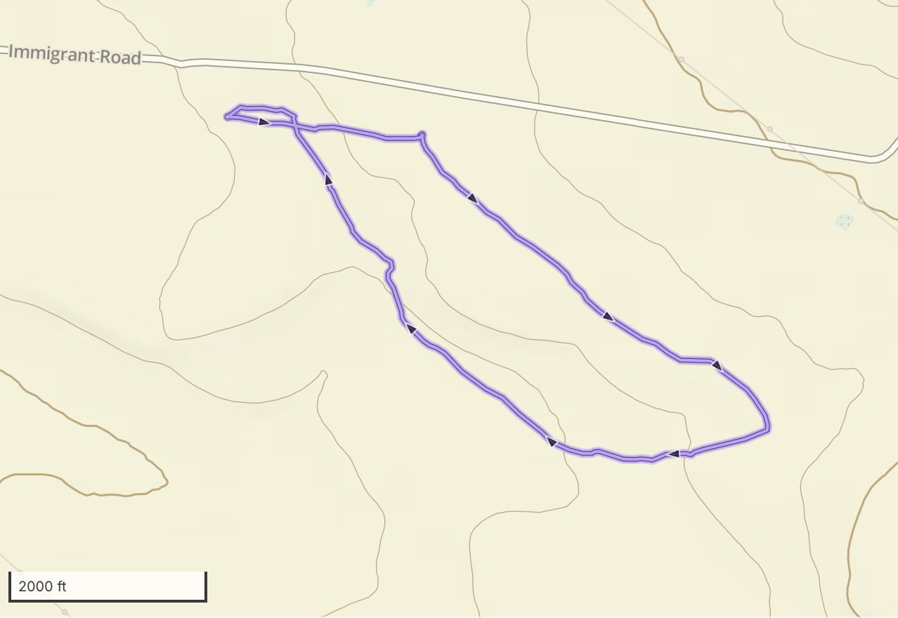

<!-- markdownlint-disable-next-line no-inline-html allow details,summary -->

2025-12-28

## 2025-12-28T12:51:47-07:00(43.40603, -115.86659) 3848 feet: Cornell Boise River WMA

34° light breeze, sunny. Truck in parking lot. Other lots were empty except the
little dirt lot that I call #4.

### 2025-12-28T13:49:26-07:00(43.39141, -115.87917) 3640 feet

Katie pointed, then Finnegan. As I was walking up, they both moved forward, then
in a circle. Then Finnegan pointed, and Katie honored. I released them, but no
bird. Pretty work.

### 2025-12-28T14:20:32-07:00(43.39580, -115.87967) 3698 feet

Same, except it started with Finnegan pointing. What are these birds up to?

### 2025-12-28T15:01:02-07:00(43.40604, -115.86664) 3837 feet

Truck. Katie 12.5 miles, Finnegan 13.9 miles, Ben 3.5 miles & 300 feet

Still sunny, slightly more breeze.

Truck that was here is gone now.

Cattle moving around in WMA

On the drive home, I notice a truck parked at the next lot.

<!-- markdownlint-disable-next-line no-inline-html allow details,summary -->

2026-01-02

## 2026-01-02T12:06-07:00(43.40332, -115.86100) 3731 feet: Cornell Boise River WMA

48°, light breeze, mostly cloudy, road is muddy

### 2026-01-02T12:48:58-07:00(43.40785, -115.84962) 4048 feet

Finnegan points and Katie honors. I move in front of him, but no bird flushes. I
release him, he moves forward a bit, then locks up again. This time he releases
himself and moves forward with Katie, but no bird. She circles behind him and
flushes about eight birds. The grass is barely moving, so it’s quite calm.

A few minutes later, Finnegan goes on point at just under 300 yards. I made it
to within 50 yards of him before he moved. Then he locked up again, this time
pointing the opposite direction. Before I started moving again, he went off
searching again. It was cool to watch Katie move towards him and then honor him.
I began to wonder if she wasn't going to honor him, but she was running with her
head down, in grass that was above her head. I had no doubt when she finally saw
him. What a pretty dog!

I peeled out of my wool pullover and am still sweating.

### 2026-01-02T13:30:38-07:00(43.40742, -115.83998) 4334 feet

I was still panting from climbing the ridge and was concentrating on my
breathing when one hun flushed right in front of me. Katie was taking a break
and was walking with me. Damn.

To the east, I see another ravine with significant brush (meaning water) growing
in it. I don’t have time for it today.

### 2026-01-02T14:24:50-07:00(43.40340, -115.86108) 3732 feet

Truck. Katie 12.8 miles, Finnegan 16.4 miles, Ben 3.5 miles & 670 feet

Slightly less overcast, otherwise unchanged.

I’m whipped.

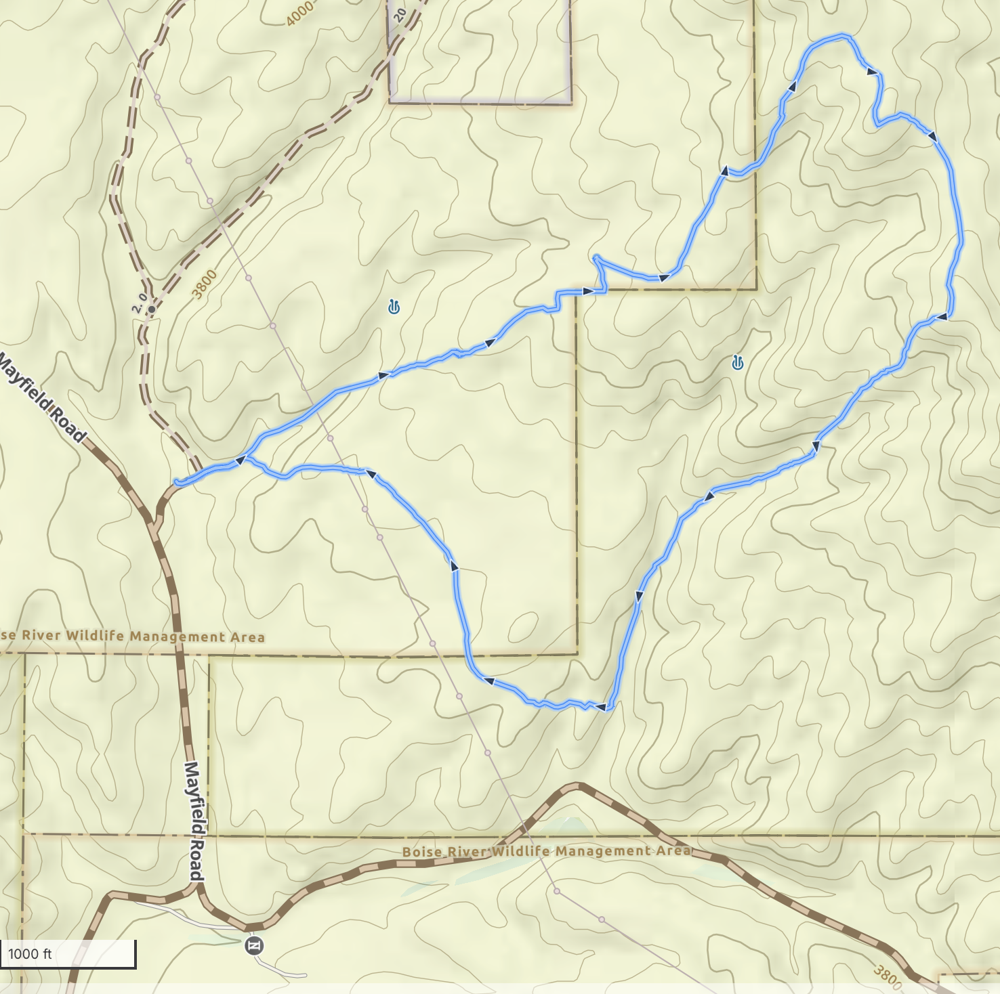

<!-- markdownlint-disable-next-line no-inline-html allow details,summary -->

2026-01-08

## 2026-01-08T14:51-07:00(43.40351, -115.86114) 3729 feet: Cornell Boise River WMA

32°, windy, broken overcast. An inch or so of snow on the ground.

A truck pulled out of the lot as I was parking.

### 2026-01-08T15:07:58-07:00(43.40410, -115.85890) 3756 feet

We’re just out of the parking lot when Finnegan and Katie point about six birds.

### 2026-01-08T15:26:44-07:00(43.39946, -115.85550) 3802 feet

Katie points a covey. When I got to them, Finnegan was in front of her, but I
don’t think she could have seen him to honor from where she is, *and* I got her
&ldquo;on point&rdquo; signal first, so I suspect he moved in front of her. As I
moved in, she moved forward. When she passed him, the birds flushed and chaos
ensued.

### 2026-01-08T16:41:09-07:00(43.40348, -115.86112) 3741 feet

Truck. Katie 10.8 miles Finnegan 12.7 miles Ben 2.9 miles 1432 feet

No more contacts. 32°. The wind has died down some.

<!-- markdownlint-disable-next-line no-inline-html allow details,summary -->

2026-01-10

## 2026-01-10T15:01-07:00(43.38299, -115.87837) 3577 feet: Cornell Boise River WMA

40° calm, hazy skies. Cattle loose on the BLM land across from the WMA.

### 2026-01-10T15:37:48-07:00(43.39297, -115.87229) 3703 feet

Katie is 60 to 70 yards to my right when eight or so birds flush 20 or 30 yards
in front of me. I wonder what made them move? Getting hunted hard?

She doesn’t react at all until she walks through the spot where the birds
flushed. There really is no wind.

### 2026-01-10T15:47:22-07:00(43.39595, -115.87246) 3730 feet

Katie finds and points the covey again. This time she presses them too hard and
they flush a little before I’m in range. But she got to make her own point.

### 2026-01-10T15:52:46-07:00(43.39709, -115.87065) 3715 feet

Katie is pointing 6 to 8 mule deer which held until I came on the scene. Her
tail was wagging.

### 2026-01-10T16:50:36-07:00(43.38305, -115.87835) 3541 feet

Truck. Katie 12.1 miles Ben 3.2 miles & 276 feet

40°, slight breeze.

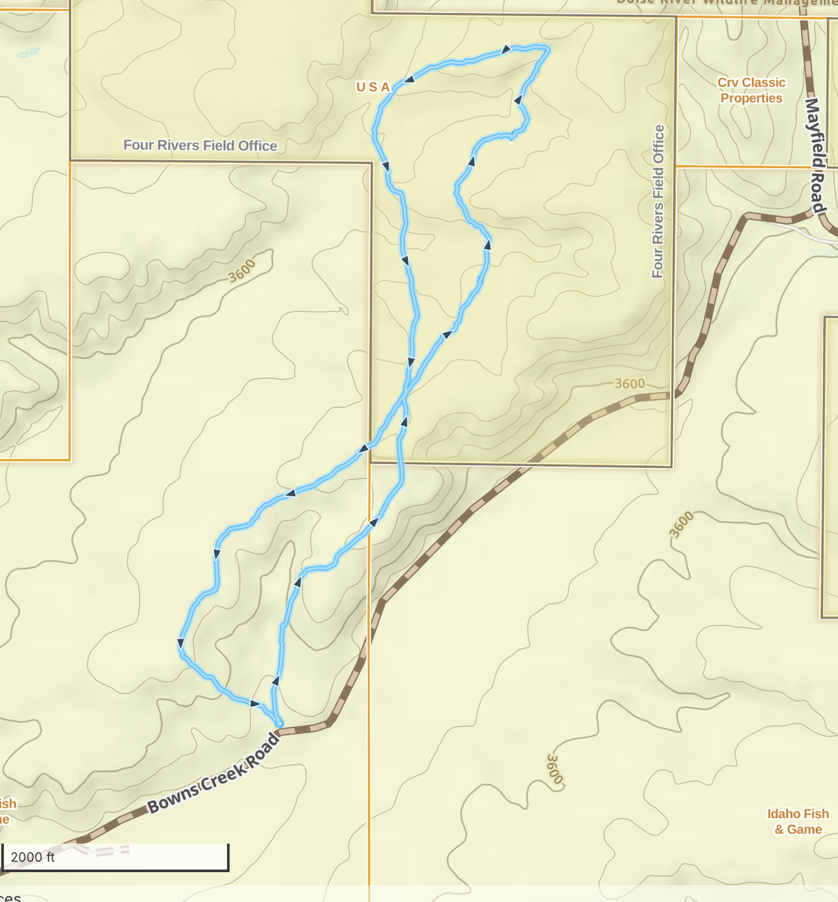

<!-- markdownlint-disable-next-line no-inline-html allow details,summary -->

2026-01-11

## 2026-01-11T13:32:15-07:00(43.38304, -115.87830) 3532 feet: Cornell Boise River WMA

37° light breeze moderate overcast. Lot #1. Leslie is heading to parking lot #3
and will hunt towards me.

### 2026-01-11T14:26:27-07:00(43.39487, -115.88432) 3708 feet

Three huns flush from 50 or 70 yards to my front left. Finnegan is 160 yards to
my right. It’s not completely calm, like yesterday, but it’s pretty calm. He’s
been working hard, so I can’t fault him.

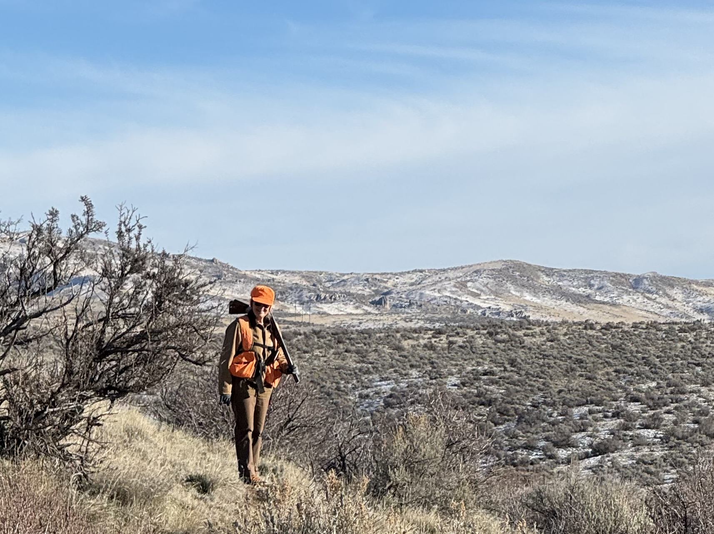

### 2026-01-11T15:21:20-07:00(43.40605, -115.86667) 3846 feet

Truck. Katie 8.3 miles, Finnegan 14.7 miles, Ben 2.3 miles & 235 feet, Leslie
1.8 miles

Mostly sunny with a very light breeze

Leslie had no bird contacts. My only contact was the small covey that I flushed.

<!-- markdownlint-disable-next-line no-inline-html allow details,summary -->

2026-01-15

## 2026-01-15T15:11:31-07:00(43.40331, -115.86101) 3735 feet Cornell Boise River WMA

31°, dense fog (I84 was a little scary) and calm

### 2026-01-15T16:13:43-07:00(43.41443, -115.84630) 4253 feet

About six birds. Most of them flushed, and then, after I had mostly recovered my
footing (damn, it’s steep), two more flushed. Might’ve winged one, but I
couldn't get the dogs to pay attention to me.

### 2026-01-15T16:25:07-07:00(43.41430, -115.84514) 4364 feet

Finnegan points in the next ravine, so it's down, up, and down again. Partway
there, about 100 yards to my east, I hear Katie yip, see 4 to 6 birds fly past,
and see that Finnegan has come off point. Don’t know what happened.

Slight breeze starting. A small patch of blue appears to the east and overhead.

### 2026-01-15T16:43:38-07:00(43.40967, -115.84589) 4223 feet

Another covey. I wonder if Katie can’t see Finnegan well enough? The fog is
pretty thick. She ran in a circle before I saw him.

### 2026-01-15T17:17:06-07:00(43.40339, -115.86110) 3728 feet

Truck. Katie 12.3 miles, Finnegan 14.6 miles, Ben 2.8 miles & 646 feet
(seems like more)

Fog has come back. Light breeze. 31°

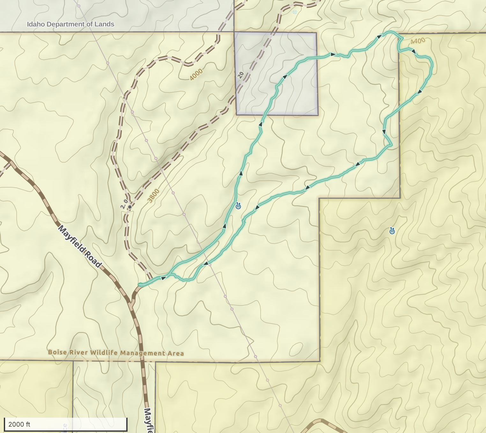

<!-- markdownlint-disable-next-line no-inline-html allow details,summary -->

2026-01-17

## 2026-01-17T14:01:53-07:00(43.25350, -115.65787) 3812 feet: Immigrant Road

31° thick overcast. Visibility is at least a few hundred yards, but I can’t see the
big ranch house. Light breeze.

### 2026-01-17T15:17:47-07:00(43.25043, -115.67002) 3741 feet

Two huns flushed from a few feet in front of her nose. I kicked around 10 to 30
yards in front of her. When nothing moved, I released her, but she didn’t move.
She was right&mdash;right&mdash;on top of them. She gave me every chance. What a
good girl.

### 2026-01-17T15:44:15-07:00(43.25352, -115.65785) 3804 feet

Truck. Katie 12 miles, Ben 3.3 miles

 29°.

I saw one jackrabbit, which, fortunately, she missed.

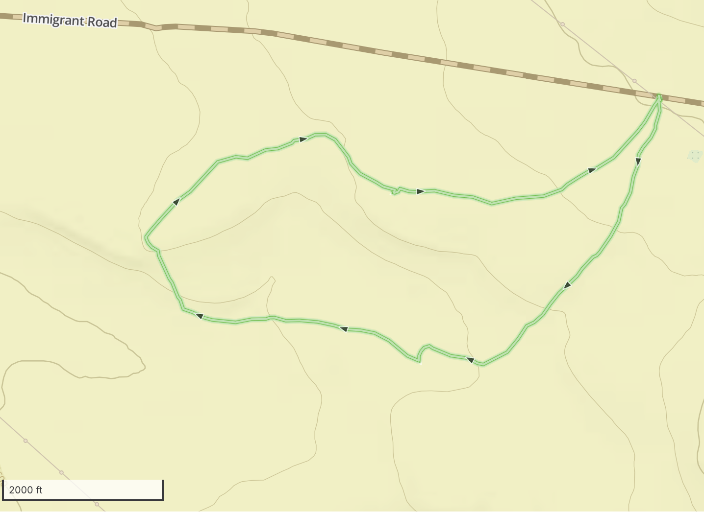

<!-- markdownlint-disable-next-line no-inline-html allow details,summary -->

2026-01-18

## 2026-01-18T14:16:01-07:00(43.40330, -115.86103) 3732 feet: Cornell Boise River WMA

28°, foggy, with a very little breeze. The inversion continues.

### 2026-01-18T15:26:42-07:00(43.40344, -115.86111) 3735 feet

Truck. Katie 6 miles Finnegan 7.2 miles, Ben 2.9 miles

Saw a few tweetie-birds, but no game of any sort. The brush is covered in frozen
fog, so both dogs are quite wet, which is why I turned back early.

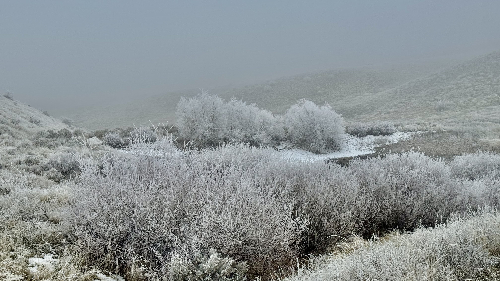

<!-- markdownlint-disable-next-line no-inline-html allow details,summary -->

2026-01-22

## 2026-01-22T15:33:39-07:00(43.26962, -115.68599) 3805 feet: Syrup Creek Road

25°, thick, low clouds, and calm.  I parked near the power line.

### 2026-01-22T17:03:09-07:00(43.26995, -115.68866) 3791 feet

Finnegan points. Katie doesn’t see him, so I caution her (&ldquo;easy
girl&rdquo;) as she runs past. She starts looking for him, then points next to
him. I move in front of them, but no birds flush. As I turned to release the
dogs, the birds flushed. Between the setting sun, the heavy overcast, and the
rising fog, it’s getting hard to see, so though I am not sure, I think they were
quail. They certainly made a beeline to the drop-off. I haven’t seen quail here
before. We’re not far from Syrup Creek, but why would they bother to come up
here?

### 2026-01-22T17:11:26-07:00(43.26962, -115.68592) 3798 feet

Truck. Katie 8.7 miles, Finnegan 10.3 miles, Ben 2.4 miles

Slight breeze, otherwise weather unchanged.

We headed NE until we hit private property, doubled back until we hit private
property, then back to the truck.

<!-- markdownlint-disable-next-line no-inline-html allow details,summary -->

2026-01-25

## 2026-01-25T13:53:11-07:00(43.40434, -115.86120) 3747 feet: Cornell Boise River WMA

37°, light wind, sunny

I'm hunting Finnegan. Leslie is hunting Katie. We will link up with them later.

### 2026-01-25T14:33:07-07:00(43.42064, -115.85212) 4260 feet

Finnegan made a point at the top of the ridge, but by the time I huffed my way
up to him, he had softened and moved on. A few hundred yards later, he went
downhill and pointed in a ravine that is blocked from the wind. He held them
until I made my way just above him. As I started to work my way down, they
flushed up over the ridge and down. They’re learning from chucker, dammit.

### 2026-01-25T15:56:00-07:00(43.40605, -115.86669) 3841 feet

Truck. Katie 12.8, Leslie 2.5, Finnegan 15.4 miles, Ben 4.1 miles & 624 feet

Finnegan and I got to the truck before Leslie and Katie. I guess the wait was
too long for him because he went off hunting by himself.

<!-- markdownlint-disable-next-line no-inline-html allow details,summary -->

2026-01-29

## 2026-01-29T15:12:46-07:00(43.25400, -115.67215) 3747 feet: Immigrant Road

46° light breeze broken overcast road is muddy from melted snow

### 2026-01-29T15:35:46-07:00(43.24981, -115.67022) 3732 feet

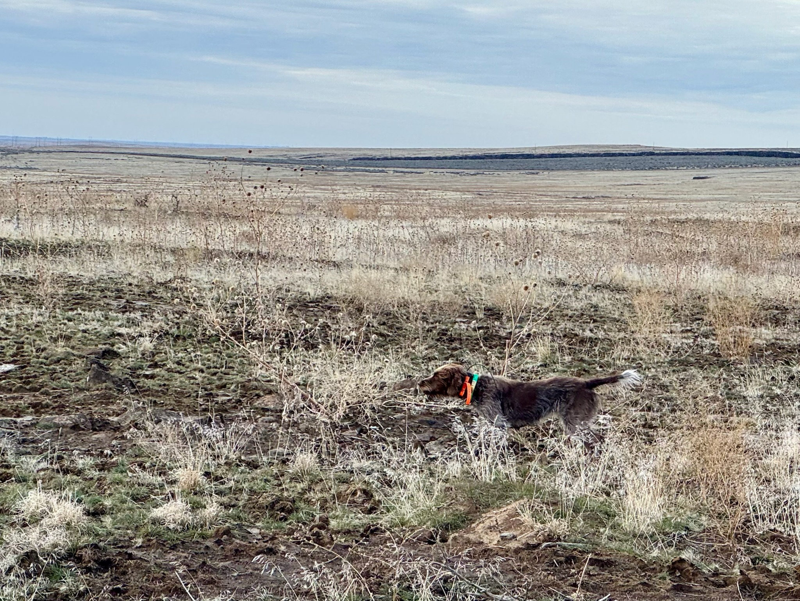

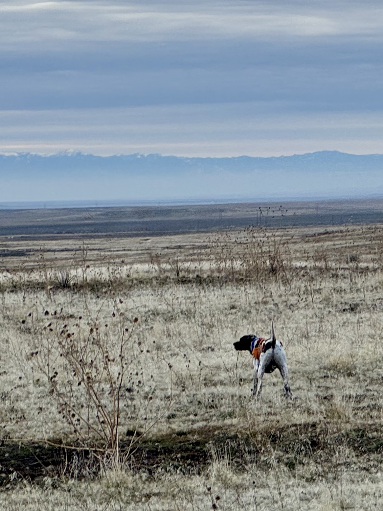

Both dogs moved, and a bird flushed. Then they both circled, and Katie flushed
the second one. Wonder where the rest of the covey is?

### 2026-01-29T15:58:35-07:00(43.24444, -115.65546) 3804 feet

They’re both running big today, so I stopped calling Finnegan back when he went
past 300 yards. He went on point at 350. When I was still over 200 yards away,
he made a half circle and pointed again. Katie stayed with him during all that.

4 to 6 birds flushed. I dropped one, and to my surprise, Finnegan stayed close,
picked it up, carried it in a few steps, spit it out, went back, picked it up
again, carried it a few more steps, spit it out again. I don’t understand, but
it made me happy.

### 2026-01-29T16:08:34-07:00(43.24262, -115.65350) 3852 feet

Katie goes on point, and I head to her. I get within about 20 yards of her when
eight or so birds flush right over her head. Finnegan was not in the picture and
just came running in and smelled them where they were. It is interesting that he
seems to know that they’re gone.

### 2026-01-29T16:54:29-07:00(43.25398, -115.67217) 3754 feet

Truck. Katie 11.6 miles, Finnegan 13.1 miles, Ben 2.9 miles

I fillet breast off the bird & feed one to each dog. One gulp each.

<!-- markdownlint-disable-next-line no-inline-html allow details,summary -->

2026-01-30

## 2026-01-30T12:16:50-07:00(43.38303, -115.87837) 3544 feet: Cornell Boise River WMA

46° almost calm, high broken overcast.

Penultimate day of the season.

### 2026-01-30T12:55:44-07:00(43.38049, -115.89540) 3550 feet

Katie points at 150 yards. I climbed to her, got within range, and then moved in
front of her. Then Finnegan showed up and pointed from behind her. No bird, even
after both dogs moved. Then they circled around, came back to much the same
spot, and pointed at the same bush from opposite directions with less than 10
feet between them. Then they both shook, he ran off, and she ran circles around
the spot.

### 2026-01-30T13:20:02-07:00(43.38730, -115.90189) 3526 feet

Katie had four huns but she didn’t sell it to me. She kept cocking her head and
she was not her usual intense self. I waited for her to figure it out, and
eventually, they flushed.

### 2026-01-30T13:29:35-07:00(43.38661, -115.89803) 3575 feet

Finnegan pointed two birds. I maneuvered around him, thinking they would flush
down hill. Instead, they flushed over my head. I did a quick pivot and got off a
shot, but no luck. I might’ve heard a third flush, but Katie was yipping so much
that I’m not sure. If these were the birds we flushed earlier, they flew back
towards where they had come.

### 2026-01-30T14:20:16-07:00(43.38301, -115.87834) 3535 feet

Truck. Katie 11.9, Finnegan 14.8, Ben 3.4 miles

Light breeze, 47° overcast

<!-- markdownlint-disable-next-line no-inline-html allow details,summary -->

2026-01-31

## 2026-01-31T13:44:42-07:00(43.38306, -115.87836) 3537 feet Cornell Boise River WMA

45°, overcast, calm.

We moved birds here yesterday so I brought us back here to finish the season.

### 2026-01-31T14:22:14-07:00(43.37952, -115.89527) 3535 feet

Unproductive, but very pretty dog work by both. They both pointed for a while,
then one would move, then the other. This went on for several minutes before
they moved on.

### 2026-01-31T14:34:36-07:00(43.38152, -115.89734) 3582 feet

I peeled out of a layer, gave the dogs a snack, and more water. A few minutes
after stepping off, I flushed two birds. Both dogs were well out in front of me,
one to my left and the other to my right. I guess they didn’t check in front of
me.

Katie come back to check why I yelped. Before she got to me, she pointed in a
deep crouch, and quivered. Unfortunately, the birds were gone.

### 2026-01-31T15:48:04-07:00(43.38876, -115.88211) 3635 feet

Finnegan went on point at over 300 yards from me. Katie was around 150 yards
from me when she pointed or honored him. I made it to them when the birds
flushed. Both dogs chased.

### 2026-01-31T16:05:06-07:00(43.38305, -115.87834) 3533 feet

Truck. Katie 15.5 miles, Finnegan 19 miles, Ben 4.2 miles & 1385 feet

46°, calm.

What a season. Our fun ticket is well and truly punched. Damn, I’m lucky.

## End of season total

Katie 382.5 miles, Finnegan 436.3 miles, Ben 107.7 miles
